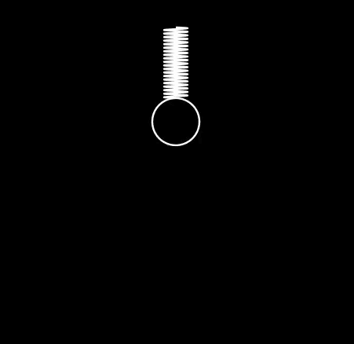

# Vertical Spring Simulation

A Manim animation of a mass moving on a vertical spring, with its motion calculated using the RK4 method.



The simulation solves the linear differential equation of the mass's motion, derived from Newton's equations of motion for a vertical spring. It uses the fourth-order Runge–Kutta (RK4) method to calculate the solution numerically.

The spring is drawn as a sinusoidal function whose length changes with the mass's position, mimicking the shape of a real spring as it stretches and compresses.

To render the animation, open a terminal in this folder and run:

This project requires [uv](https://docs.astral.sh/uv/), a Python dependency manager, to install and run its dependencies.

```powershell
uv run manim -pql "RK4 Vertical Spring.py" Animation
```
